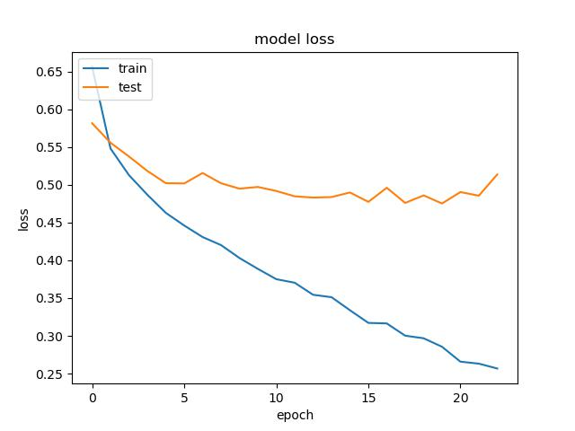
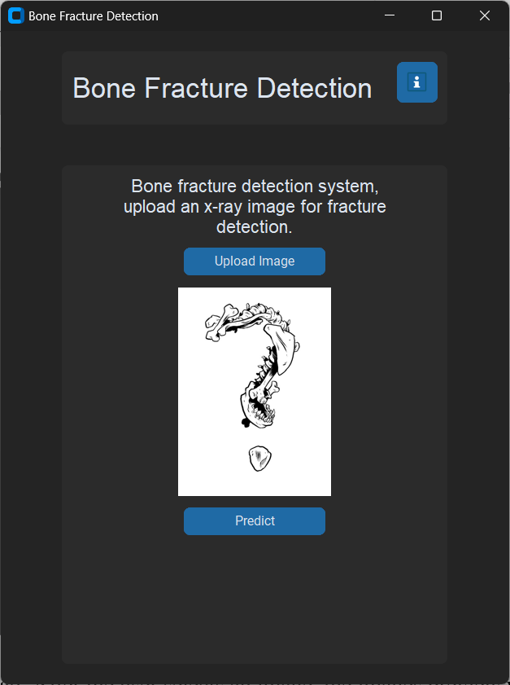

# Bone-Fracture-Detection

## Introduction

Bone fractures have been a long-standing issue for mankind, and their classification via x-ray has always depended on human diagnostics – which may sometimes be flawed. In recent years, Machine Learning and AI-based solutions have become an integral part of our lives, including in the medical field.

In the scope of our research and project, we have been studying the issue of classification and have been trying, based on previous attempts and research, to develop and fine-tune a feasible solution for the medical field in terms of identification and classification of various bone fractures. We use CNN (Convolutional Neural Networks) in the scope of modern models, such as ResNet, DenseNet, VGG16, and so forth.

After performing multiple model fine-tuning attempts for various models, we have achieved classification results lower than the predefined threshold of confidence agreed upon later in this research. However, with the promising results we did achieve, we believe that systems of this type - machine learning and deep learning based solutions for identification and classification of bone fractures - with further fine-tuning and applications of more advanced techniques such as Feature Extraction, may replace the traditional methods currently employed in the medical field, with much better results.

## Dataset

The dataset we used is called MURA and includes 3 different bone parts. MURA is a dataset of musculoskeletal radiographs and contains 20,335 images described below:

| Part     | Normal | Fractured | Total |
|----------|--------|-----------|-------|
| Elbow    | 3160   | 2236      | 5396  |
| Hand     | 4330   | 1673      | 6003  |
| Shoulder | 4496   | 4440      | 8936  |

The data is separated into train and valid sets, where each folder contains a folder of a patient and for each patient between 1-3 images for the same bone part.

## Algorithm

Our data contains about 20,000 x-ray images, including three different types of bones - elbow, hand, and shoulder. After loading all the images into data frames and assigning a label to each image, we split our images into 72% training, 18% validation and 10% test.

The algorithm starts with data augmentation and pre-processing the x-ray images, such as horizontal flipping. The second step uses a ResNet50 neural network to classify the type of bone in the image. Once the bone type has been predicted, a specific model will be loaded for that bone type prediction from 3 different types that were each trained to identify a fracture in another bone type and used to detect whether the bone is fractured.

This approach utilizes the strong image classification capabilities of ResNet50 to identify the type of bone and then employs a specific model for each bone to determine if there is a fracture present. Utilizing this two-step process, the algorithm can efficiently and accurately analyze x-ray images, helping medical professionals diagnose patients quickly and accurately.


<!-- ## Results

### Body Part Prediction

 

### Fracture Prediction

#### Elbow

 

#### Hand

 

#### Shoulder

  -->

## Installation

First create a virtual environment

```bash
python -m venv myenv
```
or 

```bash
python3 -m venv myenv
```

Then activate it

- in windows
```bash
myenv\Scripts\activate
```

- in linux
```bash
source myenv/bin/activate
```


### Requirements

- Python 3.7+
- Install requirements.txt:
  - customtkinter
  - PyAutoGUI
  - PyGetWindow
  - Pillow
  - numpy
  - tensorflow
  - keras
  - pandas
  - matplotlib
  - scikit-learn
  - colorama

### Running the Application
use this command to run the python file 
```bash
python main.py
```

```bash
python3 main.py
```

<!-- Run `main.py`. GUI has been commented out, use API instead. -->

## API Endpoints

### /upload

Upload the file, returns "filename":"...."

Input:
```
file: file.jpg (file input)
```

Response:
```json
{
    "filename": "a00010f02_boxer_essentials-imaging-kh-compressor.jpg"
}
```

### /predict
Takes "filename":"..." as input and predicts output
Input:

```json
{
    "filename": "a00010f02_boxer_essentials-imaging-kh-compressor.jpg"
}
```
Response:
```json
{
    "bone_type": "Hand",
    "result": "fractured"
}
```

### /rules

```
Returns the rule image
```


<!-- GUI -->
<!-- Main
 -->
<!-- Info-Rules -->

<!-- Test Normal & Fractured -->
<!--  
text -->

